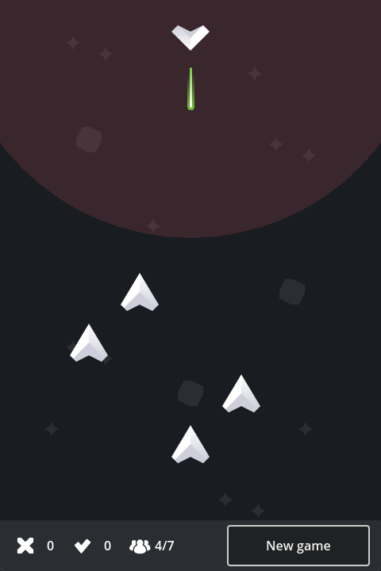

# GMTK Game Jam 2023
The GMTK Game Jam is an annual game making marathon, where individuals
and teams try to make a game that fits a theme, in just 48 hours.

The theme for the year 2023 was **Roles reversed**,
let us take on a role that we don't normally get to play.

## Space Invaders
A Space Invaders clone where you play as the invaders.

It is the final battle for the defense of the Earth-32 and they have sent their
best warrior, the Hero, as their last hope to survive.  But the bad guys always
have the biggest army and this time you are part of them!

Place up to 7 ships in strategic points and try not to get killed by the Hero.
At least 3 ships have to reach the other side of the battlefield to ensure the
conquest of the planet.

During the planning phase, it's not allowed to have more than one ship
in the same row.

Be aware that the Hero is a good pilot, can move two squares at each turn or
move one tile and fire immediately if you're in range.

## Roadmap and improvements
- add different kinds of ships
- improve Hero defense strategy
- code and scene refactoring

## Credits
The game was developed with the Godot Engine.
Ships and laser sprites from kenney.nl.
SFX from freesound.org.
